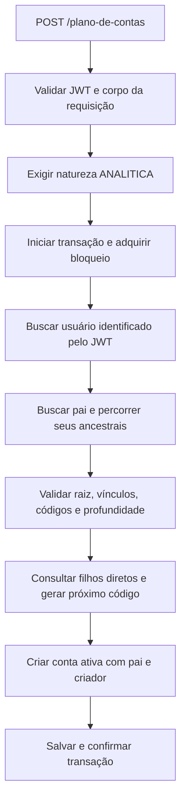
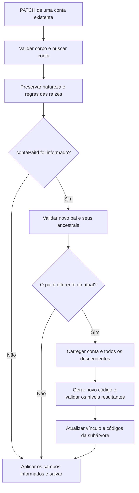

# Plano de contas: criação e atualização

Este documento descreve o comportamento implementado no módulo `plano-de-contas`: regras da árvore, geração automática de códigos, cadastro de novas contas e edição das contas existentes.

## 1. Regras da hierarquia

O plano de contas começa em quatro contas sintéticas previamente cadastradas:

| Código | Nome     | Tipo      | Natureza    | Pai     |
| ------ | -------- | --------- | ----------- | ------- |
| `1`    | ATIVOS   | `ATIVO`   | `SINTETICA` | Sem pai |
| `2`    | PASSIVOS | `PASSIVO` | `SINTETICA` | Sem pai |
| `3`    | RECEITAS | `RECEITA` | `SINTETICA` | Sem pai |
| `4`    | DESPESAS | `DESPESA` | `SINTETICA` | Sem pai |

As regras são:

- Novas contas são sempre `ANALITICA` e precisam ter um pai.
- O pai pode ser um sintético raiz ou outro analítico.
- Um analítico permanece analítico quando recebe filhos. Seus filhos também são analíticos.
- Sintéticos ficam exclusivamente na raiz, sem pai. Sua natureza e seu tipo não podem ser alterados.
- Toda cadeia de pais deve terminar em uma das quatro raízes da tabela.
- Uma conta não pode ter como pai ela mesma ou um de seus descendentes.
- A árvore aceita até **10 níveis, contando a raiz como nível 1**.

Exemplo válido:

```text
1 ATIVOS                         SINTETICA — nível 1
├── 1.1 Estoque                   ANALITICA — nível 2
│   ├── 1.1.1 Mercadorias         ANALITICA — nível 3
│   │   └── 1.1.1.1 Nacionais    ANALITICA — nível 4
│   └── 1.1.2 Matérias-primas     ANALITICA — nível 3
└── 1.2 Equipamentos              ANALITICA — nível 2
```

O cadastro pela API pressupõe que as quatro raízes já existem. O endpoint de criação não cadastra essas raízes.

## 2. Identificação e vínculo entre contas

| Campo       | Responsabilidade                                                                             |
| ----------- | -------------------------------------------------------------------------------------------- |
| `id`        | Identificador gerado pelo banco. É usado nas relações e nas URLs da API.                     |
| `codigo`    | Código hierárquico gerado pelo backend, como `1.2.3`. Pode mudar quando a conta muda de pai. |
| `nome`      | Nome informado no cadastro ou na edição.                                                     |
| `tipo`      | Classificação: `ATIVO`, `PASSIVO`, `RECEITA` ou `DESPESA`.                                   |
| `natureza`  | Define se a conta é `SINTETICA` ou `ANALITICA`.                                              |
| `contaPai`  | Relação com o pai, armazenada na conta filha.                                                |
| `filhos`    | Relação inversa: contas cujo `contaPai` aponta para esta conta.                              |
| `criadoPor` | Usuário autenticado que criou a conta, identificado pelo `sub` do JWT.                       |
| `isActive`  | Indica se a conta está ativa; novas contas começam com `true`.                               |

**`id` e `codigo` são diferentes.** Uma raiz pode ter `id = 101` e `codigo = "1"`. Para criar um filho dela, enviamos `contaPaiId = 101`.

O DTO recebe `contaPaiId`. O serviço busca esse registro e atribui a relação `contaPai` antes de salvar. A relação `filhos` passa a representar o vínculo a partir dessa referência no filho.

Todos os IDs utilizados nos exemplos deste documento são ilustrativos.

## 3. Geração automática do código

A regra é:

```text
código da nova conta = código do pai + "." + próximo número entre seus filhos diretos
próximo número = maior número atual entre esses filhos + 1
```

| Código do pai | Códigos dos filhos diretos existentes | Próximo código |
| ------------- | ------------------------------------- | -------------- |
| `1`           | Nenhum                                | `1.1`          |
| `1`           | `1.1`, `1.2`                          | `1.3`          |
| `1`           | `1.1`, `1.4`                          | `1.5`          |
| `1`           | `1.2`, `1.9`                          | `1.10`         |
| `1.1`         | `1.1.1`, `1.1.2`                      | `1.1.3`        |

O serviço consulta apenas os filhos diretos daquele pai. Por exemplo, `1.2.99` é um neto de `1` e não interfere na próxima sequência dos filhos de `1`.

A sequência considera contas ativas e inativas. Inativar `1.9` mantém esse código na consulta; o próximo filho continua sendo `1.10`.

O sufixo é comparado como número usando `BigInt`. Isso permite avançar corretamente de `9` para `10` e evita perda de precisão na leitura de números grandes. O resultado é armazenado como uma string.

Cada vínculo deve ter um código coerente com o pai: um filho de `1.2` deve usar `1.2.N`, com `N` inteiro positivo, sem zeros à esquerda. Um código inconsistente na cadeia de pais ou nos filhos consultados impede a operação.

A coluna `codigo` aceita até **255 caracteres** e possui uma restrição de unicidade no banco. O backend também verifica o tamanho antes de salvar.

### Sequência após uma mudança de pai

A sequência é calculada pelos filhos atualmente vinculados ao pai. Ela não é um contador histórico separado.

Se `1.2` mudar para outra posição e restar apenas `1.1` sob a raiz `1`, um novo filho dessa raiz poderá receber `1.2` novamente. A conta movida terá outro código, mantendo seu `id` original.

## 4. Fluxo de criação

### Requisição

Endpoint: `POST /plano-de-contas`.

Cabeçalho de autenticação:

```http
Authorization: Bearer <access_token>
```

Exemplo de corpo para criar Estoque abaixo da raiz ATIVOS, cujo ID neste exemplo é `101`:

```json
{
  "nome": "Estoque",
  "tipo": "ATIVO",
  "natureza": "ANALITICA",
  "contaPaiId": 101
}
```

Todos os campos desse corpo são obrigatórios:

| Campo        | Validação                                                                          |
| ------------ | ---------------------------------------------------------------------------------- |
| `nome`       | String não vazia.                                                                  |
| `tipo`       | Um valor do enum `TipoPlanoConta`.                                                 |
| `natureza`   | Um valor do enum `NaturezaConta`; o serviço aceita somente `ANALITICA` na criação. |
| `contaPaiId` | Número inteiro maior ou igual a 1.                                                 |

O cliente não precisa enviar `codigo`, `criadoPor` ou `isActive`. Campos que não estão no DTO são descartados pelo `ValidationPipe`, configurado com `whitelist: true`.

### Etapas executadas



1. O guard verifica o token de acesso e disponibiliza o usuário autenticado.
2. O controller valida o DTO e encaminha o `sub` do JWT ao serviço como `criadoPorId`.
3. O serviço rejeita a criação de qualquer conta cuja natureza seja diferente de `ANALITICA`.
4. Dentro de uma transação, adquire o bloqueio da hierarquia e verifica se o usuário existe no banco.
5. Busca o pai e percorre a cadeia de ancestrais até uma raiz sintética válida.
6. Calcula o nível da nova conta: nível do pai mais 1. O resultado deve ser no máximo 10.
7. Gera o código a partir dos filhos diretos do pai, incluindo os inativos.
8. Monta a conta com `natureza = ANALITICA`, `isActive = true`, `contaPai` e `criadoPor`.
9. Salva a conta e confirma a transação. Uma falha impede a conclusão do cadastro.

Se a raiz `1` ainda não tiver filhos, a conta Estoque receberá `codigo = "1.1"`. Seu `id` será gerado pelo banco.

Para criar Mercadorias abaixo de Estoque, basta enviar o ID de Estoque como `contaPaiId`. Se ele ainda não tiver filhos, Mercadorias receberá `1.1.1`. Ambos permanecem analíticos.

## 5. Atualização de contas existentes

Endpoint: `PATCH /plano-de-contas/:id`, com o mesmo cabeçalho de autenticação.

O PATCH aceita os campos do cadastro de forma opcional. Campos omitidos mantêm seus valores atuais. Campos enviados como `null` não passam na validação do DTO.

O serviço primeiro busca a conta existente. Se ela não for encontrada, retorna `404`.

### Alteração somente do nome

```http
PATCH /plano-de-contas/201
```

```json
{
  "nome": "Estoque de mercadorias"
}
```

Apenas o nome é alterado. O pai, o código e os descendentes mantêm seus valores.

### Natureza e raízes

- Informar a mesma natureza que a conta já possui é permitido.
- Mudar a natureza de `ANALITICA` para `SINTETICA`, ou de `SINTETICA` para `ANALITICA`, retorna `422`.
- Informar `contaPaiId` para uma conta sintética retorna `422`, pois ela deve permanecer na raiz.
- Mudar o tipo de uma raiz sintética retorna `422`, preservando a correspondência entre os códigos `1` a `4` e seus tipos.
- O nome de uma raiz sintética pode ser editado.

### Alteração do pai

```http
PATCH /plano-de-contas/201
```

```json
{
  "contaPaiId": 301
}
```



As etapas da mudança de pai são:

1. Validar o novo pai, seus ancestrais e a ausência de ciclos.
2. Se o ID informado for o mesmo do pai atual, manter o código existente.
3. Se o pai for diferente, carregar a conta e todos os seus descendentes.
4. Gerar o próximo código disponível entre os filhos diretos do novo pai.
5. Verificar a profundidade e o tamanho do código resultante de cada conta da subárvore.
6. Substituir o prefixo antigo pelo novo prefixo nos códigos.
7. Atualizar a relação `contaPai` da conta movida e salvar toda a subárvore na mesma transação.

Os IDs de todas as contas permanecem iguais. Nos descendentes, os IDs de seus pais também permanecem iguais: quem muda de pai é a conta no início da subárvore.

### Exemplo completo: antes e depois

Considere que Estoque tem `id = 201`, Mercadorias tem `id = 202`, Nacionais tem `id = 203` e Operações tem `id = 301`.

Antes:

```text
1 ATIVOS
├── 1.1 Estoque                       id 201
│   └── 1.1.1 Mercadorias             id 202
│       └── 1.1.1.1 Nacionais         id 203
└── 1.2 Operações                     id 301
    └── 1.2.1 Equipamentos
```

Ao editar Estoque com `contaPaiId = 301`, seu novo pai será Operações. O próximo filho de Operações recebe o número `2`.

Depois:

```text
1 ATIVOS
└── 1.2 Operações                     id 301
    ├── 1.2.1 Equipamentos
    └── 1.2.2 Estoque                 id 201
        └── 1.2.2.1 Mercadorias       id 202
            └── 1.2.2.1.1 Nacionais   id 203
```

| Conta                 | Código anterior | Código novo | ID do pai após a mudança |
| --------------------- | --------------- | ----------- | ------------------------ |
| Estoque, ID `201`     | `1.1`           | `1.2.2`     | `301`, alterado          |
| Mercadorias, ID `202` | `1.1.1`         | `1.2.2.1`   | `201`, preservado        |
| Nacionais, ID `203`   | `1.1.1.1`       | `1.2.2.1.1` | `202`, preservado        |

O serviço preserva os sufixos relativos dos descendentes. Por exemplo, o sufixo `.1.1` de Nacionais é acrescentado ao novo código de Estoque.

Os outros ramos mantêm seus códigos. A operação não reorganiza nem renumera todos os irmãos do pai anterior.

## 6. Como os ciclos são impedidos

Considere a sequência:

```text
Estoque → Mercadorias → Nacionais
```

Estoque não pode escolher Mercadorias nem Nacionais como pai. Isso criaria uma cadeia circular.

A validação começa no novo pai e sobe pelos ancestrais. Se encontrar o ID da conta que está sendo editada, rejeita a mudança. Esse procedimento encontra filhos, netos e descendentes de qualquer nível.

Um conjunto de IDs visitados também detecta repetições na cadeia de ancestrais, evitando percorrer indefinidamente uma hierarquia que já esteja inconsistente.

Na criação, a nova conta ainda não possui descendentes. Mesmo assim, o pai e sua cadeia são validados para garantir que a inserção ocorra em uma hierarquia válida.

## 7. Como o limite de 10 níveis é aplicado

Na criação:

```text
nível da nova conta = nível do pai + 1
```

Na mudança de pai, o limite precisa ser respeitado por toda a subárvore:

```text
novo nível da conta movida = nível do novo pai + 1
novo nível de um descendente = novo nível da conta movida + distância até esse descendente
```

| Situação                                            | Resultado                                                 |
| --------------------------------------------------- | --------------------------------------------------------- |
| Criar um filho de uma conta no nível 9              | Permitido: o filho fica no nível 10.                      |
| Criar um filho de uma conta no nível 10             | Rejeitado: o filho ficaria no nível 11.                   |
| Mover uma conta sem filhos para um pai no nível 9   | Permitido: a conta fica no nível 10.                      |
| Mover uma conta com um filho para um pai no nível 9 | Rejeitado: o descendente ficaria no nível 11.             |
| Mover uma conta com um filho para um pai no nível 8 | Permitido: a conta fica no nível 9 e o filho no nível 10. |

Se qualquer descendente ultrapassar o limite, a mudança inteira é rejeitada. O pai e os códigos anteriores são preservados.

## 8. Transações e cadastros simultâneos

Criação, atualização e inativação usam `emTransacao`, com isolamento `READ COMMITTED`.

Antes de consultar ou alterar a hierarquia, o serviço adquire um bloqueio transacional do PostgreSQL com a chave `plano-de-contas:hierarquia`:

```sql
SELECT pg_advisory_xact_lock(hashtext($1))
```

Todas essas operações do módulo usam a mesma chave. Enquanto uma delas está em andamento, a próxima aguarda a liberação do bloqueio. Assim, dois cadastros simultâneos não consultam a mesma sequência de filhos e escolhem o mesmo próximo código.

O bloqueio é liberado ao terminar a transação. Se ocorrer uma falha durante a persistência, a transação desfaz suas alterações. Isso também protege a atualização conjunta dos códigos e do vínculo com o novo pai.

A restrição única de `codigo` no banco complementa essa proteção. Escritas feitas fora desses métodos não participam automaticamente do bloqueio adotado pelo serviço.

## 9. Contas antigas e inativação

### Edição de registros que já seguem as regras

Contas existentes podem ser editadas pelos mesmos fluxos do PATCH:

- Mudanças de nome preservam seus códigos e vínculos.
- Mudanças de pai recalculam os códigos da subárvore afetada.
- Informar o mesmo pai preserva o código atual.
- A natureza dos registros permanece igual.

### Base antiga com códigos ou vínculos inconsistentes

A implementação não executa uma migração automática dos dados antigos. Alterar o tamanho da coluna ou adicionar unicidade não corrige códigos, ciclos ou pais incorretos.

Antes de usar esses fluxos em uma base antiga, é necessário conferir:

1. As quatro raízes têm os códigos e tipos da tabela inicial e não possuem pai.
2. Todas as contas abaixo delas são analíticas e possuem pai.
3. Os códigos representam os vínculos existentes, sem duplicidade.
4. As cadeias de pais não contêm ciclos e respeitam os 10 níveis.

Uma base fora dessas regras precisa de uma rotina específica de correção dos dados, preservando os IDs e reconstruindo os códigos a partir dos vínculos válidos. Essa rotina não faz parte do módulo atual.

A entidade declara `codigo` com tamanho 255 e unicidade. A aplicação utiliza `DB_DATABASE_SYNCHRONIZE` para controlar a sincronização do esquema: quando habilitada, as mudanças da entidade são aplicadas na inicialização do backend. Quando desabilitada, o esquema precisa ser atualizado pelo processo de migração adotado no ambiente.

### Inativação lógica

Endpoint: `DELETE /plano-de-contas/:id`.

A operação define `isActive = false` na conta. O registro, seu código e seus vínculos permanecem no banco. A inativação de uma conta não inativa automaticamente seus descendentes.

Contas inativas continuam entrando na consulta que calcula o próximo código. A validação atual de pai também não exige que ele esteja ativo.

## 10. Validações e respostas de erro

| HTTP                       | Exemplo de situação                                                                                                                                                           |
| -------------------------- | ----------------------------------------------------------------------------------------------------------------------------------------------------------------------------- |
| `400 Bad Request`          | Corpo inválido: campo obrigatório ausente, enum inválido ou `contaPaiId` nulo, textual, fracionário ou menor que 1.                                                           |
| `401 Unauthorized`         | Token ausente ou inválido; na criação, usuário identificado pelo token não encontrado no banco.                                                                               |
| `404 Not Found`            | Conta que será editada ou inativada não existe; pai informado ou ancestral consultado não encontrado.                                                                         |
| `422 Unprocessable Entity` | Criação de sintético, mudança de natureza, atribuição de pai a sintético, ciclo, hierarquia incoerente, profundidade acima de 10 ou código gerado acima do tamanho permitido. |

A validação do corpo acontece no controller. Por isso, um `contaPaiId = null` enviado pela API retorna `400`. O método privado de validação também protege chamadas diretas ao serviço e usa `422` quando recebe um ID de pai inválido.

### Outros detalhes do comportamento atual

- `tipo` dos analíticos é recebido pelo DTO e pode ser editado. O serviço não herda automaticamente esse valor do pai nem exige igualdade entre o tipo do pai e o do filho.
- Recodificar descendentes altera seus códigos; seus nomes, tipos e naturezas são preservados.
- `isActive` não está nos DTOs de criação ou atualização. A criação define esse campo no backend e a inativação ocorre pelo DELETE.
- As consultas atuais retornam registros em uma lista paginada ou um registro por ID. Elas não montam a árvore completa nem carregam automaticamente a relação `filhos`.

## 11. Onde localizar a implementação

| Arquivo                                                                       | Responsabilidade                                                                        |
| ----------------------------------------------------------------------------- | --------------------------------------------------------------------------------------- |
| [Serviço](../src/plano-de-contas/plano-de-contas.service.ts)                  | Criação, edição, inativação, transações, validação de ancestrais, códigos e subárvores. |
| [Controller](../src/plano-de-contas/plano-de-contas.controller.ts)            | Rotas, autenticação, validação do corpo e encaminhamento do criador autenticado.        |
| [DTO de criação](../src/plano-de-contas/dto/create-plano-de-conta.dto.ts)     | Campos obrigatórios e validações de entrada.                                            |
| [DTO de atualização](../src/plano-de-contas/dto/update-plano-de-conta.dto.ts) | PATCH parcial, permitindo omissão e rejeitando valores nulos.                           |
| [Entidade](../src/plano-de-contas/entities/plano-de-conta.entity.ts)          | Colunas, unicidade do código e relações pai/filhos e criador.                           |
| [Constantes](../src/plano-de-contas/plano-de-contas.constants.ts)             | Códigos das raízes, limite de níveis e tamanho máximo do código.                        |

Os métodos privados do serviço dividem as responsabilidades:

| Método                 | Responsabilidade                                                                   |
| ---------------------- | ---------------------------------------------------------------------------------- |
| `emTransacao`          | Executar a operação dentro de transação e adquirir o bloqueio da hierarquia.       |
| `validarPai`           | Buscar o pai, percorrer ancestrais e validar raiz, códigos, ciclos e profundidade. |
| `proximoCodigo`        | Gerar o próximo código entre os filhos diretos do pai.                             |
| `numeroDoFilho`        | Verificar o prefixo do pai e extrair o número do filho.                            |
| `buscarSubarvore`      | Buscar descendentes por nível, verificando vínculos e códigos.                     |
| `validarNivel`         | Rejeitar profundidades superiores a 10.                                            |
| `validarTamanhoCodigo` | Rejeitar códigos superiores a 255 caracteres.                                      |

## 12. Verificação por testes

Os testes unitários estão em [testes do serviço](../src/plano-de-contas/plano-de-contas.service.spec.ts) e [testes dos DTOs](../src/plano-de-contas/plano-de-contas.dto.spec.ts).

Eles cobrem criação com usuário autenticado, sequência numérica, filhos de analíticos, limite de níveis, pais inválidos, ciclos, PATCH parcial, recodificação de descendentes, preservação das raízes e inativação lógica.

O cenário de cadastros concorrentes usa um repositório e um bloqueio simulados. Esses testes não constituem um teste de integração com PostgreSQL.

Para executar a suíte a partir da raiz do projeto:

```sh
cd backend
npm test -- --runInBand --runTestsByPath src/plano-de-contas/plano-de-contas.service.spec.ts src/plano-de-contas/plano-de-contas.dto.spec.ts
```
