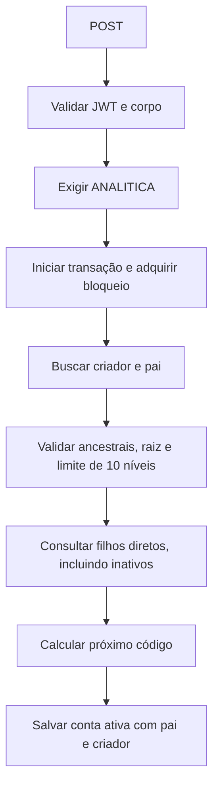
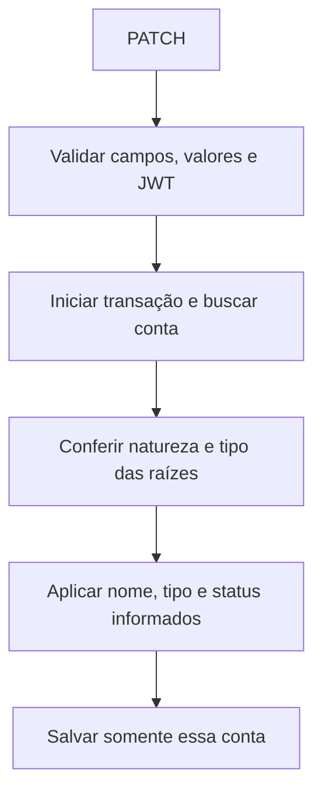

# Plano de contas: criação, edição e inativação

Este documento descreve o fluxo do módulo `plano-de-contas`. O pai, o código e a natureza são definidos no cadastro e permanecem fixos. Edição, inativação e reativação não recalculam códigos nem alteram descendentes.

## 1. Regras da hierarquia

O plano de contas começa em quatro contas sintéticas previamente cadastradas:

| Código | Nome     | Tipo      | Natureza    | Pai     |
| ------ | -------- | --------- | ----------- | ------- |
| `1`    | ATIVOS   | `ATIVO`   | `SINTETICA` | Sem pai |
| `2`    | PASSIVOS | `PASSIVO` | `SINTETICA` | Sem pai |
| `3`    | RECEITAS | `RECEITA` | `SINTETICA` | Sem pai |
| `4`    | DESPESAS | `DESPESA` | `SINTETICA` | Sem pai |

- Novas contas são sempre `ANALITICA` e precisam de um pai.
- O pai pode ser uma raiz sintética ou outro analítico.
- Analíticos permanecem analíticos quando recebem filhos; seus filhos também são analíticos.
- Sintéticos permanecem sem pai, com natureza e tipo fixos.
- Toda cadeia de pais deve terminar em uma das quatro raízes válidas.
- A árvore aceita até **10 níveis, contando a raiz como nível 1**.
- Depois do cadastro, nenhuma conta pode mudar de pai, código ou natureza.

```text
1 ATIVOS                         SINTETICA — nível 1
├── 1.1 Estoque                   ANALITICA — nível 2
│   ├── 1.1.1 Mercadorias         ANALITICA — nível 3
│   │   └── 1.1.1.1 Nacionais    ANALITICA — nível 4
│   └── 1.1.2 Matérias-primas     ANALITICA — nível 3
└── 1.2 Equipamentos              ANALITICA — nível 2
```

O endpoint de criação pressupõe as quatro raízes existentes; ele não cadastra sintéticos.

## 2. Campos e responsabilidades

| Campo       | Responsabilidade e edição                                                   |
| ----------- | --------------------------------------------------------------------------- |
| `id`        | Identificador gerado pelo banco, usado nas relações e URLs.                 |
| `codigo`    | Código hierárquico gerado pelo backend somente na criação; imutável.        |
| `nome`      | Nome obrigatório na criação; editável.                                      |
| `tipo`      | `ATIVO`, `PASSIVO`, `RECEITA` ou `DESPESA`; editável apenas nos analíticos. |
| `natureza`  | `SINTETICA` ou `ANALITICA`; imutável. O PATCH pode repetir o valor atual.   |
| `contaPai`  | Relação armazenada no filho, escolhida por `contaPaiId` no POST; imutável.  |
| `filhos`    | Relação inversa com as contas que apontam para esse pai.                    |
| `criadoPor` | Usuário identificado pelo `sub` do JWT na criação; preservado na edição.    |
| `isActive`  | Definido como `true` na criação; editável para inativar ou reativar.        |

**`id` e `codigo` são diferentes.** Uma raiz pode ter `id = 101` e `codigo = "1"`. Seu filho recebe `contaPaiId = 101` no POST; o serviço busca a raiz e atribui a propriedade `contaPai`.

Os IDs dos exemplos são ilustrativos. O tipo dos analíticos não é herdado automaticamente do pai nem precisa ser igual ao dele; essa regra permanece como no módulo anterior.

## 3. Função reutilizável de código

A função exportada está em [calcular-proximo-codigo.ts](../src/plano-de-contas/utils/calcular-proximo-codigo.ts):

```ts
calcularProximoCodigo(
  codigoPai: string,
  codigosDosFilhos: readonly string[],
): string
```

Ela recebe somente dados e devolve uma string. Não consulta o banco, não grava registros e não modifica ou ordena os argumentos.

```text
próximo número = maior sufixo numérico dos filhos diretos + 1
código novo = código do pai + "." + próximo número
```

| Pai   | Filhos diretos existentes | Próximo código |
| ----- | ------------------------- | -------------- |
| `1`   | Nenhum                    | `1.1`          |
| `1`   | `1.1`, `1.2`              | `1.3`          |
| `1`   | `1.1`, `1.4`              | `1.5`          |
| `1`   | `1.9`, `1.2`              | `1.10`         |
| `1.1` | `1.1.1`, `1.1.2`          | `1.1.3`        |

Os sufixos são comparados com `BigInt`, preservando a precisão de números grandes. Lacunas não são preenchidas: se existem `1.1` e `1.4`, o próximo código é `1.5`.

A função valida:

- Segmentos inteiros positivos separados por pontos, sem espaços ou zeros à esquerda.
- Cada código fornecido deve representar um filho **direto** do pai informado. `1.2.99` não pode ser passado como filho direto de `1`.
- Códigos recebidos e resultado com até **255 caracteres**.

O serviço consulta todos os filhos diretos, **incluindo inativos**, dentro da transação de criação. Se `1.9` estiver inativo, o próximo filho continua sendo `1.10`. Como as contas não são removidas nem movidas por estes endpoints, seus códigos permanecem reservados.

A função não decide a profundidade da árvore: a validação dos ancestrais no serviço aplica o limite de 10 níveis. A coluna `codigo` mantém sua restrição de unicidade no banco.

## 4. Criação: POST

Endpoint: `POST /plano-de-contas`.

Todas as rotas exigem autenticação:

```http
Authorization: Bearer <access_token>
```

Para criar Estoque sob ATIVOS, com ID `101`:

```json
{
  "nome": "Estoque",
  "tipo": "ATIVO",
  "natureza": "ANALITICA",
  "contaPaiId": 101
}
```

| Campo obrigatório | Validação                                                              |
| ----------------- | ---------------------------------------------------------------------- |
| `nome`            | String não vazia.                                                      |
| `tipo`            | Valor válido do enum `TipoPlanoConta`.                                 |
| `natureza`        | Valor válido do enum; o serviço aceita somente `ANALITICA` na criação. |
| `contaPaiId`      | Número inteiro positivo de uma conta existente.                        |

O cliente não fornece código, criador nem status. O POST usa `ValidationPipe` com `transform: true` e `whitelist: true`, descartando campos fora do DTO. O backend gera `codigo`, obtém `criadoPor` pelo JWT e define `isActive: true`.



A validação percorre os ancestrais, confere os códigos de cada vínculo e detecta IDs repetidos. O nível da nova conta é o nível do pai mais 1: criar sob o nível 9 é permitido, e criar sob o nível 10 retorna `422`.

Se ATIVOS ainda não tiver filhos, Estoque recebe `1.1`. Criar Mercadorias com o ID de Estoque como pai gera `1.1.1`, mantendo ambos analíticos.

A validação do pai não exige `isActive: true`; um pai inativo ainda pode receber filhos. Inativação e validade estrutural são regras independentes neste módulo.

## 5. Edição: PATCH

Endpoint: `PATCH /plano-de-contas/:id`.

| Campo aceito | Comportamento                                                                   |
| ------------ | ------------------------------------------------------------------------------- |
| `nome`       | Opcional; atualiza somente quando informado e válido.                           |
| `tipo`       | Opcional; analíticos podem mudar de tipo. Sintéticos só aceitam seu tipo atual. |
| `natureza`   | Opcional; só aceita o valor já registrado na conta.                             |
| `isActive`   | Opcional; aceita exclusivamente os booleanos `true` e `false`.                  |

Campos omitidos preservam seus valores. `null` é rejeitado em todos esses campos. Strings como `"false"` e números como `0` não são convertidos em booleanos.

O PATCH usa `transform: true`, `whitelist: true` e **`forbidNonWhitelisted: true`**. Enviar `contaPaiId`, `contaPai`, `codigo` ou qualquer campo desconhecido retorna **400**, inclusive quando o valor é igual ao atual. Os clientes devem remover `contaPaiId` de seus corpos de PATCH.

Chamadas diretas ao serviço também rejeitam a presença de pai ou código, com **422**. A proteção vale para valores iguais, diferentes, nulos ou `undefined`. O serviço rejeita status inválido e campos nulos antes de aplicar alterações.

### Edição parcial

```http
PATCH /plano-de-contas/201
```

```json
{
  "nome": "Estoque de mercadorias"
}
```

Somente o nome muda. É possível enviar apenas o tipo ou o status, ou combinar campos permitidos:

```json
{
  "nome": "Estoque atualizado",
  "tipo": "ATIVO",
  "isActive": false
}
```

Informar a natureza atual é permitido; tentar alterá-la retorna `422`. Alterar o tipo de um sintético também retorna `422`. Seu nome e status continuam editáveis.



A edição não consulta filhos nem gera códigos. Uma requisição inválida não salva parcialmente nome, tipo ou status. Contas inativas também podem ser editadas e reativadas.

## 6. Inativação e reativação

### Inativar pelo PATCH

```json
{
  "isActive": false
}
```

### Inativar pelo DELETE

```http
DELETE /plano-de-contas/201
```

O DELETE chama a mesma lógica de atualização do PATCH com `{ isActive: false }`. **Não há exclusão física**, alteração de pai ou recálculo de códigos.

### Reativar

```http
PATCH /plano-de-contas/201
```

```json
{
  "isActive": true
}
```

Reativar preserva o ID, código, natureza, pai e criador originais. O estado dos filhos permanece independente do estado do pai:

```text
Antes:                         Depois de inativar Estoque:
1 ATIVOS — ativo               1 ATIVOS — ativo
└── 1.1 Estoque — ativo         └── 1.1 Estoque — inativo
    ├── 1.1.1 A — ativo            ├── 1.1.1 A — ativo
    └── 1.1.2 B — inativo          └── 1.1.2 B — inativo
```

Reativar Estoque não reativa B. A mesma regra vale para as raízes sintéticas.

## 7. Cadastro em outra posição

Para usar uma conta em outra posição, o fluxo é **inativar a antiga e cadastrar uma nova sob o pai desejado**.

Considere Mercadorias com ID `202`, código `1.1.1`, sob Estoque. A raiz ATIVOS tem ID `101`, com filhos `1.1` e `1.2`.

1. Inativar Mercadorias por `DELETE /plano-de-contas/202` ou PATCH com `isActive: false`.
2. Criar outra conta sob ATIVOS:

```json
{
  "nome": "Mercadorias",
  "tipo": "ATIVO",
  "natureza": "ANALITICA",
  "contaPaiId": 101
}
```

A nova conta recebe **outro ID** e o próximo código da raiz, `1.3`. A antiga permanece com `1.1.1`, o mesmo pai e o status inativo.

```text
1 ATIVOS
├── 1.1 Estoque
│   └── 1.1.1 Mercadorias — inativa, ID 202
│       └── 1.1.1.1 Nacionais — estado e vínculo preservados
├── 1.2 Equipamentos
└── 1.3 Mercadorias — nova conta ativa, outro ID
```

Esse fluxo não transfere filhos nem referências de outros registros. Registros associados à conta antiga continuam apontando para ela. Se forem necessários filhos na nova posição, eles serão cadastrados como novas contas, recebendo seus próprios IDs e códigos.

Inativação e novo cadastro são duas requisições independentes. Se o cadastro falhar, a inativação já realizada permanece; a conta antiga pode ser reativada por PATCH.

## 8. Ciclos, transações e concorrência

Na criação, a nova conta ainda não tem descendentes. Como o pai não pode ser alterado depois, os endpoints não permitem criar ciclos por movimentação de contas. A validação dos ancestrais continua protegendo novos cadastros contra uma hierarquia antiga inconsistente.

Criação, edição e inativação continuam usando transações com isolamento `READ COMMITTED` e o bloqueio PostgreSQL da chave `plano-de-contas:hierarquia`:

```sql
SELECT pg_advisory_xact_lock(hashtext($1))
```

As operações do módulo usam a mesma chave. Cadastros simultâneos aguardam o bloqueio antes de consultar os filhos e calcular o próximo código, evitando a escolha da mesma sequência. O bloqueio é liberado ao terminar a transação; falhas desfazem suas alterações.

A restrição de unicidade de `codigo` complementa a proteção. Escritas realizadas fora desses métodos não participam automaticamente desse bloqueio.

## 9. Registros existentes

Esta alteração **não executa migração, movimentação ou recálculo dos registros existentes**. A entidade e o esquema do banco permanecem iguais.

Contas antigas conservam ID, pai, código, natureza e referências. Podem ter nome, tipo permitido e status editados; o mesmo bloqueio de pai e código vale para elas.

Códigos ou vínculos antigos inconsistentes não são corrigidos pela edição. Se forem usados como parte da hierarquia de um novo cadastro, a validação dos ancestrais e dos códigos pode rejeitar a criação. Uma correção de dados históricos exige um trabalho específico, fora deste fluxo.

## 10. Respostas de erro

| HTTP                       | Situação                                                                                                                                                                                                                                                        |
| -------------------------- | --------------------------------------------------------------------------------------------------------------------------------------------------------------------------------------------------------------------------------------------------------------- |
| `400 Bad Request`          | POST sem campo obrigatório, valor nulo, enum inválido ou pai inválido; PATCH com pai, código, campo desconhecido, campo nulo ou status não booleano.                                                                                                            |
| `401 Unauthorized`         | Token ausente ou inválido; usuário do JWT não encontrado na criação.                                                                                                                                                                                            |
| `404 Not Found`            | Conta de edição/inativação inexistente, pai inexistente ou ancestral consultado não encontrado.                                                                                                                                                                 |
| `422 Unprocessable Entity` | Criação de sintético, mudança de natureza ou tipo de raiz, hierarquia inconsistente, profundidade acima de 10 ou código inválido/acima de 255 caracteres. Também protege chamadas diretas ao serviço com pai/código na edição, status inválido ou campos nulos. |

Validações do corpo acontecem antes da chamada ao serviço. Assim, um pai enviado no PATCH retorna `400` pela API, enquanto a mesma tentativa feita diretamente no serviço retorna `422`.

As consultas continuam retornando uma lista paginada ou uma conta por ID, incluindo inativas. Não montam automaticamente a árvore completa nem carregam a relação `filhos`.

## 11. Implementação e verificação

| Arquivo                                                                       | Responsabilidade                                                                         |
| ----------------------------------------------------------------------------- | ---------------------------------------------------------------------------------------- |
| [Serviço](../src/plano-de-contas/plano-de-contas.service.ts)                  | Criação, edição, status, transações e validação dos ancestrais e níveis.                 |
| [Gerador de código](../src/plano-de-contas/utils/calcular-proximo-codigo.ts)  | Funções puras para gerar o próximo código e validar/extrair o sufixo de um filho direto. |
| [Controller](../src/plano-de-contas/plano-de-contas.controller.ts)            | Rotas, autenticação e validação dos corpos, com PATCH estrito.                           |
| [DTO de criação](../src/plano-de-contas/dto/create-plano-de-conta.dto.ts)     | Nome, tipo, natureza e pai obrigatórios.                                                 |
| [DTO de atualização](../src/plano-de-contas/dto/update-plano-de-conta.dto.ts) | Edição parcial sem pai, com status booleano e rejeição de valores nulos.                 |
| [Entidade](../src/plano-de-contas/entities/plano-de-conta.entity.ts)          | Colunas, código único, relações entre contas e criador.                                  |
| [Constantes](../src/plano-de-contas/plano-de-contas.constants.ts)             | Quatro códigos raiz, limite de 10 níveis e tamanho máximo de código.                     |

O serviço mantém `emTransacao`, `validarPai` e `validarNivel`. O cálculo do código foi extraído para `calcularProximoCodigo`; a validação dos códigos dos ancestrais usa `extrairNumeroDoFilho`. Busca de subárvores e recodificação foram removidas.

Os [testes do serviço](../src/plano-de-contas/plano-de-contas.service.spec.ts), [dos DTOs](../src/plano-de-contas/plano-de-contas.dto.spec.ts) e [do gerador](../src/plano-de-contas/utils/calcular-proximo-codigo.spec.ts) verificam:

- Criação autenticada, raízes, filhos de analíticos, profundidade e cadastros concorrentes.
- Edição parcial e rejeição de pai/código sem alterações parciais.
- Inativação e reativação preservando códigos, vínculos e estados dos descendentes.
- PATCH estrito, rejeição de campos nulos e status inválido.
- Primeiro filho, lacunas, passagem de `9` para `10`, precisão numérica, argumentos imutáveis e entradas inconsistentes.

Os testes de persistência e concorrência usam repositório e bloqueio simulados; não são testes de integração com PostgreSQL.

Para executá-los a partir da raiz do projeto:

```sh
cd backend
npm test -- --runInBand --runTestsByPath src/plano-de-contas/plano-de-contas.service.spec.ts src/plano-de-contas/plano-de-contas.dto.spec.ts src/plano-de-contas/utils/calcular-proximo-codigo.spec.ts
```
